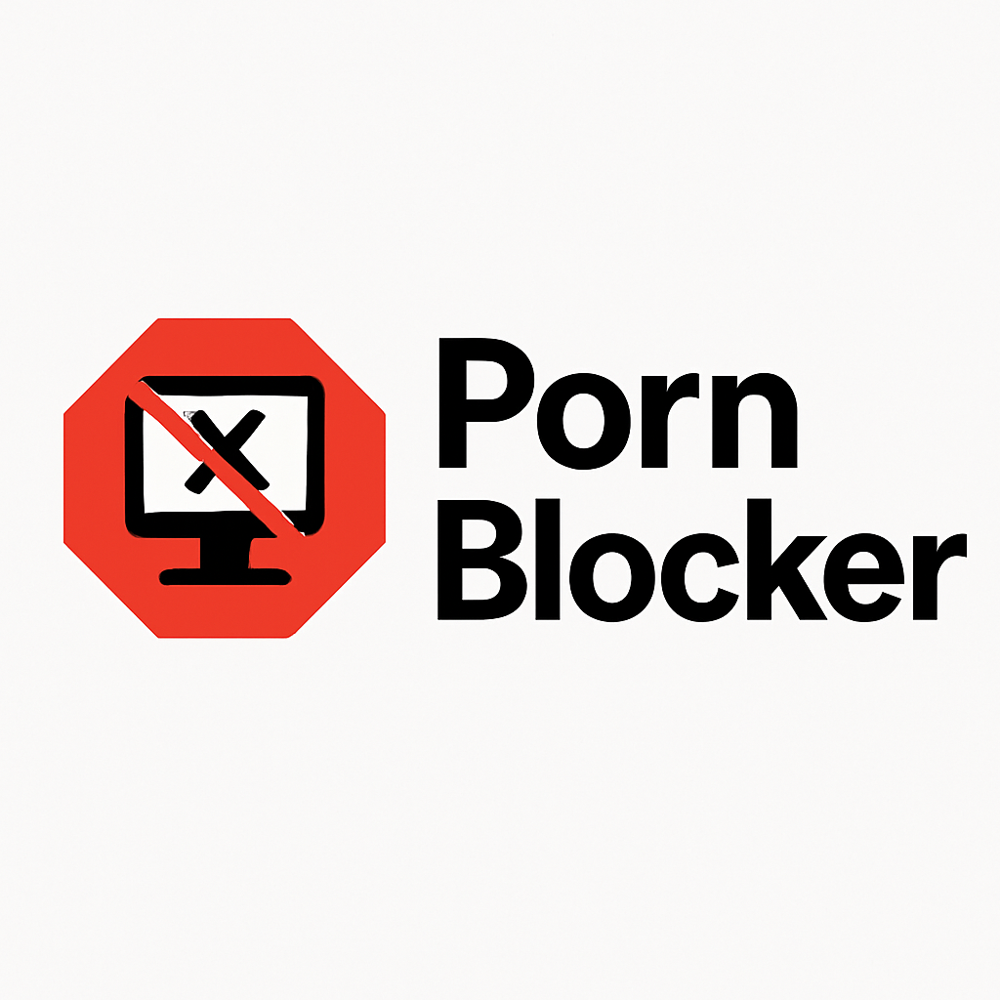

# 🚫 PornBlocker Chrome Extension

A minimalist, privacy-focused Chrome extension that **blocks pornographic websites** and **logs each attempt** with a timestamp for transparency and accountability.

## ✨ Features

- 🔐 Blocks access to sites containing pornographic keywords
- 📜 Logs blocked attempts with timestamps
- 🧾 View and clear logs from the popup menu
- ⚡️ Lightweight, fast, and simple to use
- 💾 All data is stored locally — nothing is sent to the cloud

---

## 📦 Installation

1. Clone or [download this repository](https://github.com/your-username/pornblocker)
2. Go to `chrome://extensions/`
3. Enable **Developer Mode** (top right)
4. Click **Load Unpacked**
5. Select the project folder

---

## 🧠 How It Works

The extension listens for all outgoing web requests. If a URL contains any banned keyword (e.g., `porn`, `xxx`, `nsfw`, etc.), it will block the request and log the event in the browser's local storage.

---

## 🖼️ Popup UI

- Lists all blocked URLs with timestamps
- Clear history with a single click

> All data stays on your device — no tracking, no internet access.

---

## 📁 Project Structure

